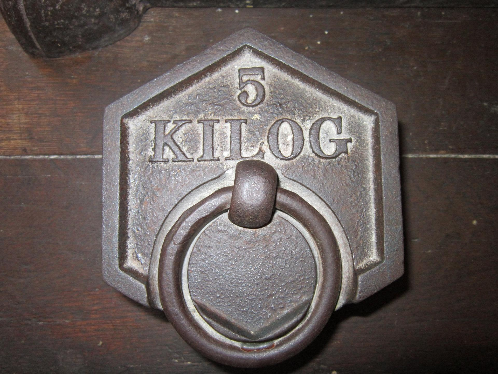

# ⚖️ MassConvert — Conversor de Moneda Profesional

[](https://developer.mozilla.org/es/docs/Web/HTML)
[](https://developer.mozilla.org/es/docs/Web/CSS)
[](https://developer.mozilla.org/es/docs/Web/JavaScript)
[](./LICENSE)

**MassConvert** es una aplicación web moderna, rápida e intuitiva diseñada para realizar conversiones de unidades de masa y peso en tiempo real con precisión. Permite calcular equivalencias de forma bidireccional entre **Kilogramos y Libras**, así como entre **Gramos y Onzas**. Construida con tecnologías web nativas, cuenta con una interfaz de estética **Neumórfica** y soporte para accesibilidad.

---

<p align="center">
  
</p>

[](https://WebsByJimenez.github.io/Conversor-de-Moneda-Profesional/)

---

## ✨ Características Principales

- ⚖️ **Conversión Bidireccional en Tiempo Real:**
  - Kilogramos (**kg**) $\leftrightarrow$ Libras (**lbs**)
  - Gramos (**g**) $\leftrightarrow$ Onzas (**oz**)
- 🎨 **Interfaz Neumórfica Modernizada:** Diseño visual táctil y limpio basado en sombras suaves y paleta de colores personalizada.
- 📋 **Copiado al Portapapeles:** Botón integrado con respuesta visual instantánea para copiar los resultados con un solo clic.
- ⚠️ **Validación en Vivo:** Manejo de errores para prevenir entradas no válidas.
- ⌨️ **Atajos de Teclado:** Presiona `Escape` para resetear los valores y volver al campo de entrada al instante.
- ♿ **Código Válido y Accesible:** Estructura que cumple con los estándares oficiales de la **W3C** e incluye etiquetas accesibles para lectores de pantalla.

---

## 🛠️ Tecnologías Utilizadas

- **HTML5:** Estructura semántica completa.
- **CSS3:** Custom Properties (Variables CSS), Flexbox, transiciones suaves y arquitectura Neumórfica.
- **JavaScript (ES6+):** Lógica modular, manipulación del DOM y API de Clipboard (`navigator.clipboard`).

---

## 📂 Estructura del Proyecto

```text
MassConvert/
├── css/
│   └── estilos.css
├── js/
│   └── index.js
├── img/
│   └── conversor_De_Moneda.jpg
├── .gitignore
├── index.html
├── LICENSE
└── README.md
```

## 🚀 Instalación y Uso Local

No requiere la instalación de dependencias ni servidores externos. Únicamente clona el repositorio u obtén los archivos y abre index.html en cualquier navegador web moderno.

## 📝 Licencia

Este proyecto es de código abierto y está disponible bajo la licencia MIT.

## 👤 Autor

Desarrollado por WebsByJiménez.
